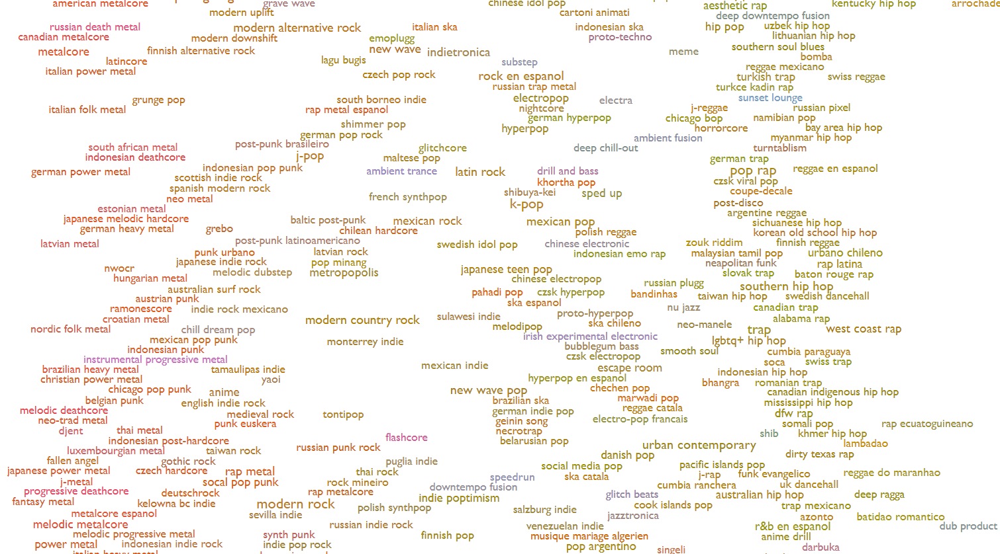

```{r echo=FALSE}
library(tidyverse)
library(ggplot2)
library(PerformanceAnalytics)
library(corrplot)
library(psych)
library(hrbrthemes)
library(agricolae)
library(FSA)
library(rstatix)
library(ggpubr)
library(plotly)
library(tidymodels)
library(recipes)
library(rpart)
library(dials)
library(rules)
library(baguette)
library(parsnip)
library(discrim)
library(doParallel)
library(sparsediscrim)
library(cvms)
library(kableExtra)
library(htmlTable)
library(shapr)
library(vip)
library(spotifyr)
library(DT)
```

```{r}
theme_set(
  theme_minimal(base_family = "sans", base_size = 12) +
  theme(
    plot.title = element_text(face = "bold", hjust = 0.5, size = 14),
    plot.subtitle = element_text(hjust = 0.5, color = "gray40"),
    panel.grid.minor = element_blank(),
    legend.position = "bottom"
  )
)
```

# Introduction

Spotify is a Swedish streaming service offering access to over **100 million tracks** and **6 million podcasts**. It has an official API that allows downloading metadata describing the portal's content and creating applications that communicate with the portal based on it, such as a recommendation system. Variables describing musical tracks that can be extracted using it include the track's energy, danceability, or tempo, which suggests that they can be used to classify a song into a specific genre. To attempt this, I decided to try building an optimal multi-class classification model that will assign a musical genre to a track based on the extracted metadata.

```{mermaid}
%%| code-fold: false
flowchart LR
  A[(Spotify API)] --> B(EDA)
  B --> C{Data Split}
  C -->|Train 80%| D(Recipes / Preprocessing)
  C -->|Test 20%| E(Testing)
  D --> F(Grid Search / Tuning)
  F --> G[Best Model]
  G --> H(Evaluation)
  E --> H
```


# Data Acquisition

## Choosing the Dependent Variable Classes

There is a wide range of musical genres in the world: from *Mongolian throat singing*, through *catstep*, to *pirate metal*. In my project, however, I had to limit myself to just a few fundamental genres that would generalize this diversity well.

[{alt="Source: https://everynoise.com/" fig-align="center"}](https://everynoise.com/)

The **FreeDB** service is a free database that was once used by people burning CDs to pre-fill track information. It describes every song located there using one of the following genres: blues, classical, country, folk, jazz, newage, reggae, rock, soundtrack. I decided that this is a fairly complete list of basic musical genres. However, I took the liberty of replacing *soundtrack* and *newage* with *hip-hop* and *metal*, and then based on it, I defined the states that the dependent variable will take in my model. Ultimately, the list of states that the variable determining the genre can take looks as follows:

-   blues,

-   classical,

-   country,

-   folk,

-   jazz,

-   hip-hop,

-   reggae,

-   rock,

-   metal.

## Creating the Dataset Using the API

The Spotify API allows for the simultaneous downloading of data for all tracks from a selected album, artist profile, or playlist. In order to create a dataset, I searched the service for several playlists containing tracks of a given genre so that there were 200-300 observations per genre and the dataset was as balanced as possible, and then I joined the results into one dataframe.

```{r eval=FALSE}
playlist_names <- c(
  "Blues Classics", "Blues Standards", "Electric Blues Classics", "Classic Blues Guitar",
  "Classical Essentials", "Classical New Releases", 
  "Country's Greatest Hits", "Hot Country", "Country Top 50", 
  "Fresh Folk", "Roots Rising", 
  "jazz classics the best tunes in jazz history", 
  "Hip-Hop Drive", "Gold School", "RAP GENERACJA",
  "Reggae Classics", "Summer Sunshine Reggae", "celebrating the film bob marley one love", "Reggae Party", 
  "Rock Classics", "All New Rock",
  "Metal Essentials", "00s Metal Classics", "10s Metal Classics"
  )

pb <- txtProgressBar(min = 0,
                     max = length(playlist_names),
                     style = 3,
                     width = 50,
                     char = "=") 

dataset <- NULL

for (p in 1:length(playlist_names)) {
  
  search_results <- search_spotify(
    q = playlist_names[p], 
    type = c("playlist"), 
    authorization = get_spotify_access_token()
  )
  
  playlist_id <- search_results %>%  
    select(id, name, uri) %>% 
    slice_head(n = 1) %>% 
    select(id) %>% 
    pull()
  
  p_dt <- get_playlist_audio_features(
    username = "Spotify",
    playlist_uris = c(playlist_id), 
  )
  
  if (p == 1) {
    dataset <- p_dt
  }
  else {
    dataset <- rbind(dataset, p_dt)
  }

  setTxtProgressBar(pb, p)
}

df <- as.data.frame(dataset)
df <- df[,-which(sapply(df, class) == "list")]

# write.csv(df, "spotify-genres-classification.csv")
# write.csv(df, "spotify-genres-classification-new.csv")
```

# Dataset Processing and Cleaning

## Initial Feature Selection

The dataset originally contains many unnecessary variables, such as the identifier of the playlist from which a given track originates or a link to the cover of each song.

```{r echo=FALSE}
file <- read.csv("spotify-genres-classification-new.csv")
kable(head(file), "html") %>% kable_styling("striped") %>% scroll_box(width = "100%")
```

They should be disposed of immediately to increase the transparency of the dataset and facilitate further analysis.

```{r echo=FALSE}
print_oneperline <- function(x) {
  cat(sprintf(paste0('% ', floor(log10(length(x))) + 3,'s "%s"\n'), 
              paste0("[", seq_along(x), "]"), x), sep = "")
  }
```

```{r echo=FALSE}
df <- file %>% 
  select(-c("X", "playlist_id", "playlist_img", "playlist_owner_name", "playlist_owner_id", "track.id", "analysis_url", "added_at", "is_local", "primary_color", "added_by.href", "added_by.id", "added_by.type", "added_by.uri", "added_by.external_urls.spotify", "track.disc_number", "track.episode", "track.href", "track.is_local", "track.preview_url", "track.track", "track.track_number", "track.type", "track.uri", "track.album.album_type", "track.album.href", "track.album.id", "track.album.name", "track.album.total_tracks", "track.album.type", "track.album.uri", "track.album.external_urls.spotify", "track.external_ids.isrc", "track.external_urls.spotify", "video_thumbnail.url", "track.album.release_date_precision"))
```

```{r echo=FALSE}
# print_oneperline(colnames(df))
```

The feature set after initial selection thus looked as follows:

| Feature | Description |
|-----------------------|------------------------------------------------|
| `playlist_name` | Name of the playlist the track comes from |
| `danceability` | Track's "danceability" - continuous variable taking values in the range \[0, 1\] |
| `energy` | Track's energy - continuous variable taking values in the range \[0, 1\] |
| `key` | Track's key - categorical variable whose values correspond to notation from <https://en.wikipedia.org/wiki/Pitch_class> |
| `loudness` | Track's loudness in decibels - continuous variable taking negative values |
| `mode` | Categorical variable taking the value 1 if the track is in a minor key and 0 if the track is in a major key |
| `speechiness` | "Speechiness" of the track's lyrics - continuous variable taking values in the range \[0, 1\] |
| `acousticness` | Determines the probability that the track is acoustic - continuous variable taking values in the range \[0, 1\] |
| `instrumentalness` | Determines the probability that the track contains no vocals - continuous variable taking values in the range \[0, 1\] |
| `liveness` |  |
| `valence` | Determines how positively the track is tuned - continuous variable taking values in the range \[0, 1\] |
| `tempo` | Continuous variable determining the song's tempo in bpm (*beats per minute*) |
| `time_signature` | Categorical variable determining the musical meter, where e.g., the value 3 means a 3/4 meter |
| `track.explicit` | Categorical variable taking the value TRUE for tracks with explicit content and FALSE for others |
| `track.duration_ms` | Continuous variable determining the track's duration in milliseconds |
| `track_name` | Identifier determining the track's name |
| `track_popularity` | Track's popularity - continuous variable taking values in the range \[0, 100\] |
| `track.album.release_date` | Track's release date |
| `key_name` | Categorical variable determining the key the track is in |
| `mode` | Categorical variable determining the key, taking the value `minor` or `major` |
| `key_mode` | Combination of the `key_name` and `key_mode` variables |

: Feature set description

::: callout-note
I intentionally kept the `track_name` variable acting as an identifier to facilitate working with the dataset and interpreting the results.
:::

Looking at the above feature set, one can immediately notice that the `mode_name` variable is redundant with respect to the `mode` variable, `key_name` is redundant with respect to `key`, and `key_mode` being a combination of the previous variables is also superfluous, so I am getting rid of them right away.

```{r}
df <- df %>%
  select(-c(key_mode, key_name, mode_name))
```

## Creating the Dependent Variable Determining the Track Genre

The variable determining the genre was not part of the feature set extracted directly from the API, so I have to create it myself using the variable determining the name of the playlist from which the track originates.

```{r echo=FALSE}
kable(table(df$playlist_name), "html", col.names = c("Variable", "Frequency")) %>%   kable_styling("striped") %>% 
  scroll_box(height = "500px")
```

```{r}
df$genre <- "NA"

metal_playlists <- c("00s Metal Classics", "10s Metal Classics", "Metal Essentials")
hiphop_playlists <- c("Hip-Hop Drive", "Gold School", "RAP GENERACJA")
rock_playlists <- c("All New Rock", "Rock Classics")
blues_playlists <- c("Blues Classics", "Blues Standards", "Classic Blues Guitar", "Electric Blues Classics")
classical_playlists <- c("Classical Essentials", "Classical New Releases")
country_playlists <- c("Country's Greatest Hits", "Country Top 50", "Hot Country")
folk_playlists <- c("Fresh Folk", "Roots Rising")
jazz_playlists <- c("Jazz Classics")
reggae_playlists <- c("Reggae Classics", "Summer Sunshine Reggae", "Reggae Party")

df[df$playlist_name %in% metal_playlists,]$genre <- "metal" 
df[df$playlist_name %in% hiphop_playlists,]$genre <- "hiphop" 
df[df$playlist_name %in% rock_playlists,]$genre <- "rock" 
df[df$playlist_name %in% blues_playlists,]$genre <- "blues" 
df[df$playlist_name %in% classical_playlists,]$genre <- "classical" 
df[df$playlist_name %in% country_playlists,]$genre <- "country" 
df[df$playlist_name %in% folk_playlists,]$genre <- "folk" 
df[df$playlist_name %in% jazz_playlists,]$genre <- "jazz" 
df[df$playlist_name %in% reggae_playlists,]$genre <- "reggae" 

df <- df %>% 
  filter(genre != "NA")
```

The number of tracks belonging to individual genres presents itself as follows. It can be seen that, as intended, each genre has 200-300 observations, thanks to which the dataset is fairly balanced.

```{r echo=FALSE}
kable(table(df$genre), "html", col.names = c("Variable", "Frequency")) %>% 
  kable_styling("striped")
```

The `genre` variable determining the genre has already been created, so I can get rid of the `playlist_name` feature.

```{r}
df <- df %>% 
  select(-playlist_name)
```

## Checking for Missing Values

```{r}
any(is.na(df))
```

```{r echo=FALSE}
kable(df[!complete.cases(df), ], "html") %>% kable_styling("striped")
```

It looks like the dataset has missing values. After displaying them, however, it turns out that they constitute a single row in which the values of every variable except `genre` are NA. This is probably due to the API downloading a track from a classical music playlist that is no longer available on the service. Given that this is the only row with missing values in the entire dataset, it can safely be disposed of without the need for data imputation.

```{r}
df <- na.omit(df)
any(is.na(df))
```

## Checking for Duplicates

Observations from individual genres are mostly made up of tracks from several different playlists. However, it is not excluded that in a few playlists for a single genre, a certain song was repeated. It should therefore be investigated whether such a situation occurred and we are dealing with duplicates.

```{r echo=FALSE}
duplicated(df$track.name) %>% 
  table() %>% 
  kable("html", table.attr = "style='width:30%;'", col.names = c("Is duplicated", "Frequency")) %>% 
  kable_styling("striped")
```

It turns out that as many as 162 tracks were repeated in our dataset. Their repetitions should be removed to eliminate the problem of identical observations.

```{r}
df <- df %>% 
  distinct(track.name, .keep_all = TRUE)
```

After leaving rows with unique titles in the dataset, the problem is resolved.

```{r echo=FALSE}
duplicated(df$track.name) %>% 
  table() %>% 
  kable("html", table.attr = "style='width:30%;'", col.names = c("Is duplicated", "Frequency")) %>% 
  kable_styling("striped") 
```

## Data Validity Verification

```{r echo=FALSE}
devtools::source_gist('4a0a5ab9fe7e1cf3be0e')
strtable(df) %>% 
  select(-levels) %>%  
  kable("html") %>% 
  kable_styling("striped") %>% 
  scroll_box(height = "500px")
```

Displaying the type and sample observations for each variable immediately allows us to notice a few problems with the dataset that will have to be addressed. These include, among others, incorrect data types or the fact that the variable representing the date on which the track was published is sometimes expressed with accuracy to the day, and sometimes to the release year.

```{r echo=FALSE}
funs <- lst(min, median, mean, max, sd)

df$track.popularity <- as.numeric(df$track.popularity)

t(map_dfr(funs,
        ~ summarize(df %>% select(-c(key, mode, time_signature)), 
                    across(where(is.numeric), .x, na.rm = TRUE)),
        .id = "statistic")) %>% 
  kable("html") %>% 
  kable_styling("striped")
```

Descriptive statistics for continuous variables also illustrate several anomalies in our dataset. It can be seen, for example, that there is a track with a tempo equal to 0, which is impossible. There are also observations with zero popularity, which is highly unlikely considering that practically every playlist from which data was downloaded contained genre classics.

### Removing the Row with Zero Tempo

```{r}
#| code-fold: true

df[df$tempo < 40, ] %>% kable("html") %>% kable_styling("striped")
```

After displaying all rows that have a tempo below 40 bpm, it turns out that there is only one such track. It can therefore be removed without fear that it will cause a huge difference in the dataset.

```{r}
df <- df %>% 
  filter(tempo != 0)
```

### Abandoning the `popularity` Variable

```{r}
#| code-fold: true

ggplot(df, aes(x = track.popularity)) + geom_histogram(bins = 30, fill = "#F8766D") + labs(title = "Histogram of `popularity` variable")
```

Displaying the histogram of the `popularity` variable allows one to notice that we have a lot of variables with popularity equal or close to 0. Let's check how many rows have "zero" popularity.

```{r}
nrow(df[df$track.popularity == 0, ])
```

```{r}
tail(df[df$track.popularity == 0, ]$track.name, 10)
```

We have as many as 245 such rows. It can therefore be concluded that this variable is not defined by the Spotify service in a correct way and contains improbable values, which is confirmed by the fact that Slayer's track "Repentless" also has "zero" popularity. This prompted me to eliminate it from the dataset.

```{r}
df <- df %>% 
  select(-track.popularity)
```

### Changing Values in the `time_signature` Column

```{r echo=FALSE}
table(df$time_signature) %>% 
  kable("html", table.attr = "style='width:30%;'", col.names = c("Value", "Frequency")) %>% 
  kable_styling("striped")
```

After displaying the number of tracks in particular meters, it turns out that the dataset is dominated by tracks in the most popular meter, which is 4/4. However, it is suspicious that we have 18 tracks in a 1/4 meter, which is most likely an error. Let's look at the tracks in this meter to identify the source of such coding.

```{r}
tail(df[df$time_signature == 1, ]$track.name)
```

It turns out that this meter is assigned either to tracks that have a "fluid" structure, characteristic of classical music, or those that are characterized by an unstable meter, meaning one that frequently changes during the course of the track. A good example is the track "Money" by the band Pink Floyd (the main motif is in 7/4, but then during the "bridge" it transitions to 4/4, and then 6/4, to later return to 7/4 again), or the track "Pneuma" by the band Tool, where the meter changes practically all the time (it even has a repeating segment in which we are dealing with consecutive measures in the meters 33/16, 33/16, 28/16, and 30/16!).



So it is no wonder that the API, when extracting the meter from these songs, "went crazy" and classified them as 1/4, which would roughly mean that there is one beat per entire measure, which is of course untrue in this case. Given that tracks in 3/4 and 5/4 meters, as well as "tracks in 1/4 meter", occur relatively rarely, I decided to merge them into one "other" category, while leaving tracks in 4/4 meter unchanged.

```{r echo}
df$time_signature <- as.character(df$time_signature)
df$time_signature <- ifelse(df$time_signature == "4",
                            df$time_signature, 
                            "other")
```

This is how the division of tracks due to the presence of a 4/4 meter or another presents itself now.

```{r echo=FALSE}
table(df$time_signature) %>% 
  kable("html", table.attr = "style='width:30%;'", col.names = c("Value", "Frequency")) %>% 
  kable_styling("striped")
```

### Changing the `track.album.release_date` Variable to the `decade` Variable

From previous deductions, it resulted that the variable representing the release date of the track is expressed with varying accuracy, because sometimes we have the full date given in it, and sometimes only the year. In order to unify the accuracy of the value of this feature, I decided to extract only the year from each date. Then I decided that it would be a good idea to assign each year to a particular decade in order to categorize the variable. There were few songs from the 30s, 40s, 50s, and 60s, so I grouped them into one "other" category (or `<70`), to make the groups more balanced.

```{r}
df$track.album.release_date <- substr(df$track.album.release_date, 1, 4)
colnames(df)[16] <- "release_year"
df$release_year <- as.integer(df$release_year)
df$decade <- (df$release_year - df$release_year %% 10) %% 100
df[df$decade %in% c(30, 40, 50, 60), ]$decade <- "<70"
df[df$decade == 0, ]$decade <- "00"
df$decade <- as.character(df$decade)
df$decade <- factor(df$decade, levels = c("<70", "70", "80", "90", "00", "10", "20"))

df <- df %>% 
  select(-release_year)
```

In this way, I created the categorical variable `decade`, which takes the following values with a given frequency:

```{r echo=FALSE}
table(df$decade) %>% 
  kable("html", table.attr = "style='width:30%;'", col.names = c("Value", "Frequency")) %>% 
  kable_styling("striped")
```

### Changing Values in the `track.explicit` Column to 0 and 1

The `track.explicit` variable takes boolean values TRUE or FALSE, so I decide to change them to values 1 and 0, where 1 corresponds to a track that contains explicit content.

```{r}
df$track.explicit <- ifelse(df$track.explicit == TRUE, 1, 0)
```

The distribution of this feature presents itself as follows:

```{r echo=FALSE}
table(df$track.explicit) %>% 
  kable("html", table.attr = "style='width:30%;'", col.names = c("Value", "Frequency")) %>% 
  kable_styling("striped")
```

### Coding Categorical Variables

Variables that take a limited number of values were appropriately coded as categorical variables.

```{r}
df$genre <- factor(df$genre)
df$key <- factor(df$key)
df$mode <- factor(df$mode)
df$time_signature <- factor(df$time_signature)
df$track.explicit <- factor(df$track.explicit)
```

### Changing the Unit in the `track.duration_ms` Variable to Seconds

The `track.duration_ms` variable is expressed in milliseconds, thus taking very large values. To facilitate the interpretation of this feature, I will change the unit to seconds by dividing its values by 1000.

```{r}
df$track.duration_s <- df$track.duration_ms / 1000
df <- df %>% 
  select(-track.duration_ms)
```

## Effect of Dataset Processing and Cleaning

```{r echo=FALSE}
devtools::source_gist('4a0a5ab9fe7e1cf3be0e')
strtable(df) %>% 
  select(-levels) %>%  
  kable("html") %>% 
  kable_styling("striped") %>% 
  scroll_box(height = "500px")
```

It can be seen that all variables now have correctly encoded types.

```{r echo=FALSE}
funs <- lst(min, median, mean, max, sd)

t(map_dfr(funs,
        ~ summarize(df %>% select(-c(key, mode, time_signature)), 
                    across(where(is.numeric), .x, na.rm = TRUE)),
        .id = "statistic")) %>% 
  kable("html") %>% 
  kable_styling("striped")
```

Descriptive statistics also show no irregularities in the dataset.

# Visualizing Relationships Between Variables

## Distributions of Variables

::::: panel-tabset
#### Categorical Variables

::: panel-tabset
##### Genre

```{r echo=FALSE}
ggplot(df, aes(x = genre)) + geom_bar(fill = "#F8766D")
```

##### Keys

```{r echo=FALSE}
ggplot(df, aes(x = key, fill = mode)) + geom_bar()
```

##### Meter

```{r echo=FALSE}
ggplot(df, aes(x = time_signature, fill = genre)) + geom_bar()
```

##### Explicitness

```{r echo=FALSE}
ggplot(df, aes(x = track.explicit, fill = genre)) + geom_bar()
```

##### Decade

```{r echo=FALSE}
ggplot(df, aes(x = decade, fill = genre)) + geom_bar()
```
:::

#### Continuous Variables

::: panel-tabset
##### Danceability

```{r echo=FALSE}
ggplot(df, aes(x = danceability)) + geom_histogram(bins = 30, fill = "#F8766D")
```

##### Energy

```{r echo=FALSE}
ggplot(df, aes(x = energy)) + geom_histogram(bins = 30, fill = "#F8766D")
```

##### Loudness

```{r echo=FALSE}
ggplot(df, aes(x = loudness)) + geom_histogram(bins = 30, fill = "#F8766D")
```

##### Speechiness

```{r echo=FALSE}
ggplot(df, aes(x = speechiness)) + geom_histogram(bins = 30, fill = "#F8766D")
```

##### Acousticness

```{r echo=FALSE}
ggplot(df, aes(x = acousticness)) + geom_histogram(bins = 30, fill = "#F8766D")
```

##### Instrumentalness

```{r echo=FALSE}
ggplot(df, aes(x = instrumentalness)) + geom_histogram(bins = 30, fill = "#F8766D")
```

##### Liveness

```{r echo=FALSE}
ggplot(df, aes(x = liveness)) + geom_histogram(bins = 30, fill = "#F8766D")
```

##### Valence

```{r echo=FALSE}
ggplot(df, aes(x = valence)) + geom_histogram(bins = 30, fill = "#F8766D")
```

##### Tempo

```{r echo=FALSE}
ggplot(df, aes(x = tempo)) + geom_histogram(bins = 30, fill = "#F8766D")
```

##### Duration

```{r echo=FALSE}
ggplot(df, aes(x = track.duration_s)) + geom_histogram(bins = 30, fill = "#F8766D")
```
:::
:::::

::: callout-important
It is clearly visible that some continuous variables have heavy-tailed asymmetrical distributions. This means that some machine learning models will require prior transformation of these variables to force greater symmetry of the distributions.
:::

### Decade Distributions Depending on Genre

```{r echo=FALSE}
genres <- unique(df$genre)
```

::: panel-tabset
##### Blues

```{r echo=FALSE}
ggplot(df[df$genre == genres[1], ], aes(x = decade)) + geom_bar(fill = "#F8766D") + labs(title = str_to_sentence(paste0(genres[1], " in decades"))) + theme(plot.title = element_text(hjust = 0.5, size = 25))
```

##### Classical

```{r echo=FALSE}
ggplot(df[df$genre == genres[2], ], aes(x = decade)) + geom_bar(fill = "#F8766D") + labs(title = str_to_sentence(paste0(genres[2], " in decades"))) + theme(plot.title = element_text(hjust = 0.5, size = 25))
```

##### Country

```{r echo=FALSE}
ggplot(df[df$genre == genres[3], ], aes(x = decade)) + geom_bar(fill = "#F8766D") + labs(title = str_to_sentence(paste0(genres[3], " in decades"))) + theme(plot.title = element_text(hjust = 0.5, size = 25))
```

##### Folk

```{r echo=FALSE}
ggplot(df[df$genre == genres[4], ], aes(x = decade)) + geom_bar(fill = "#F8766D") + labs(title = str_to_sentence(paste0(genres[4], " in decades"))) + theme(plot.title = element_text(hjust = 0.5, size = 25))
```

##### Jazz

```{r echo=FALSE}
ggplot(df[df$genre == genres[5], ], aes(x = decade)) + geom_bar(fill = "#F8766D") + labs(title = str_to_sentence(paste0(genres[5], " in decades"))) + theme(plot.title = element_text(hjust = 0.5, size = 25))
```

##### Hiphop

```{r echo=FALSE}
ggplot(df[df$genre == genres[6], ], aes(x = decade)) + geom_bar(fill = "#F8766D") + labs(title = str_to_sentence(paste0(genres[6], " in decades"))) + theme(plot.title = element_text(hjust = 0.5, size = 25))
```

##### Reggae

```{r echo=FALSE}
ggplot(df[df$genre == genres[7], ], aes(x = decade)) + geom_bar(fill = "#F8766D") + labs(title = str_to_sentence(paste0(genres[7], " in decades"))) + theme(plot.title = element_text(hjust = 0.5, size = 25))
```

##### Rock

```{r echo=FALSE}
ggplot(df[df$genre == genres[8], ], aes(x = decade)) + geom_bar(fill = "#F8766D") + labs(title = str_to_sentence(paste0(genres[8], " in decades"))) + theme(plot.title = element_text(hjust = 0.5, size = 25))
```

##### Metal

```{r echo=FALSE}
ggplot(df[df$genre == genres[9], ], aes(x = decade)) + geom_bar(fill = "#F8766D") + labs(title = str_to_sentence(paste0(genres[9], " in decades"))) + theme(plot.title = element_text(hjust = 0.5, size = 25))
```
:::

Here you can notice a few interesting facts. Blues and jazz tracks were overwhelmingly created earlier than the 70s, while most classical tracks in the dataset come from the 20s. Another interesting observation is that almost all folk songs come from the 20s—only a handful of them date back to the 10s. It is worth noting that these distributions do not, however, reflect the actual process of popularization of these genres - they merely reflect the characteristics of the dataset.

## Explicit Content Depending on Genre

```{r echo=FALSE}
df %>% 
  filter(track.explicit == 1) %>% 
  group_by(genre) %>% 
  summarise(n = n()) %>%
  mutate(all = c(187, 226, 238, 248, 235, 247)) %>% 
  ggplot(aes(x = reorder(genre, -n), y = n)) + geom_bar(stat = "identity", fill = "#F8766D") + xlab("genre") + ylab("count") + 
geom_text(aes(label = paste0(round(n/all*100, 2), "%")), position = position_dodge(width = 0.9), vjust = -0.25) + 
labs(caption = "Values on the bars represent the ratio of explicit tracks to all tracks in a given genre") + theme(plot.caption = element_text(hjust = 0))
```

It is no surprise that the most tracks containing explicit content come from the hip-hop genre (almost 90% of tracks from this genre contain them). Next in line is metal, over 1/5 of the tracks from this genre contain content inappropriate for young audiences. The only genres in which there are no profanities are blues, classical music, and jazz.

## Energy vs. Loudness of Tracks

```{r echo=FALSE}
ggplot(df, aes(x = energy, y = loudness, colour = genre)) + geom_point()
```

Track energy and loudness are features that seemingly appear to be related. The chart above proves that such a relationship indeed exists: the more energetic the track, the louder it is. Additionally, one can notice that some genres form "clouds"—metal tracks, for example, are tightly clustered in the upper right corner of the chart, meaning they are simultaneously the loudest and most energetic.

## Danceability vs. Positivity of Tracks

```{r echo=FALSE}
ggplot(df, aes(x = danceability, y = valence, colour = genre)) + geom_point()
```

Does a more positive track mean it's also more suitable for dancing? The chart above shows there is some truth to this. One can notice that the most danceable and positive genre is reggae. It may be surprising, however, that it looks like many classical pieces from the dataset are not suitable for dancing and are exceptionally depressing.

## Loudness of Tracks Over the Years

```{r echo=FALSE}
df %>% 
  group_by(decade, genre) %>% 
  summarise(loudness = round(mean(loudness), 2)) %>% 
  ungroup() %>% 
  plot_ly(x = ~decade, y = ~loudness, color = ~genre, hovertext = ~loudness) %>% 
  add_lines(hovertemplate = paste0("Average loudness: %{hovertext}"))
```

An interesting fact is that in most genres, tracks became louder from decade to decade. It is not a surprise that metal was almost always the loudest genre; in the 20s, it was characterized by an average loudness of -3.23 dB, which starkly contrasts with -23.68 dB for classical music from the same decade.

## Distributions of Track Duration

```{r echo=FALSE}
ggplot(df, aes(y = track.duration_s, x = genre, fill = genre)) + geom_boxplot() + theme(legend.position = "") + ylab("Track length")
```

Looking at the box plots of song lengths depending on the genre, one can suspect that there is a chance some distributions are similar to each other. To verify this, I intend to perform an ANOVA test. First, however, I check the required assumptions of multivariate normality in groups, group balancing, and their homogeneity.

```{r echo=FALSE}
df %>%
group_by(genre) %>%
summarise(sample_size=length(track.duration_s), p_value=shapiro.test(track.duration_s)$p.value)  %>% 
  kable("html") %>% 
  kable_styling("striped")
```

```{r}
bartlett.test(df$track.duration_s, df$genre)
```

It looks like none of the assumptions are met, so I will perform the Kruskal-Wallis test, which is the non-parametric equivalent of the ANOVA test.

```{r}
kruskal.test(track.duration_s ~ genre, df)
```

This test showed that the hypothesis stating that the mean song lengths in genres are at the same level should be rejected. To see which ones differ from each other, I will perform Dunn's test.

```{r}
dunntest <- dunn_test(df, track.duration_s ~ genre, p.adjust.method = "bonferroni")
```

```{r echo=FALSE}
dunntest <- dunntest %>% add_xy_position(x = "genre")
ggboxplot(df, x = "genre", y = "track.duration_s", fill = "genre", legend = "") + stat_pvalue_manual(dunntest, hide.ns = TRUE, label = "{round(p.adj, 2)}") 
```

The chart only shows p-values that were statistically significant. It turns out that the assumptions were incorrect - in every case, the hypothesis that the average track length is the same must be rejected.

## Dependence of the `valence` Variable on Key

In practice, minor scales and pieces based on them are considered to have a sad sound, as opposed to major scales, which are considered happy.

```{r echo=FALSE}
ggplot(df, aes(x = mode, y = valence)) + geom_boxplot()
```

Looking at the box plots, it seems that the `valence` variable does not depend on whether the track is in a major or minor key. We will receive confirmation by performing a Student's t-test, having previously checked the assumption of variance homogeneity.

```{r}
var.test(df[df$mode == 0, ]$valence, df[df$mode == 1, ]$valence)
```

The assumption of variance homogeneity is met. I will therefore perform the t-test.

```{r}
t.test(valence ~ mode, data = df)
```

The p-value of the performed test indicates that there is no basis for rejecting the hypothesis of equal means in these distributions. This means that in our dataset, the feature referring to the track's mood does not depend on the scale, which is a fairly interesting conclusion.

## Correlation Between Continuous Independent Variables

```{r echo=FALSE}
df %>% 
  select(where(is.numeric)) %>%
  cor(method = "spearman") %>% 
  corPlot(cex = 0.5, xlas = 2)
```

High correlation between independent variables can pose a problem during the construction of a machine learning model. Many sources state that it can be considered high if it exceeds the value of 0.7. In our dataset, this value is exceeded three times, between pairs of variables:

-   energy-loudness,

-   energy-acousticness,

-   loudness-acousticness.

::: panel-tabset
#### energy vs. loudness

```{r echo=FALSE}
ggplot(df, aes(x = energy, y = loudness)) + geom_point() + geom_smooth(method = "lm", formula = y ~ poly(x, 2, raw = TRUE))
```

#### energy vs. acousticness

```{r echo=FALSE}
ggplot(df, aes(x = acousticness, y = energy)) + geom_point() + geom_smooth(method = "lm")
```

#### loudness vs. acousticness

```{r echo=FALSE}
ggplot(df, aes(x = acousticness, y = loudness)) + geom_point() + geom_smooth(method = "lm", formula = y ~ poly(x, 2, raw = TRUE))
```
:::

The charts between these variables show uncovered relationships, especially in the case of energy and loudness, where the observations quite clearly align along a curve fitted with a second-degree polynomial.

```{r echo=FALSE}
fig <- plot_ly(df, x = ~energy, y = ~loudness, z = ~acousticness, color = ~genre)
fig <- fig %>% add_markers(size = 0.8)
fig <- fig %>% layout(scene = list(xaxis = list(title = 'energy'),
                     yaxis = list(title = 'loudness'),
                     zaxis = list(title = 'acousticness')))
fig
```

The three-dimensional chart shows how much these three features depend on each other.

To check if it will be possible to replace these three variables with just one of them, I will perform PCA to reduce three dimensions to one, and then check which of these variables has the greatest impact on shaping this dimension.

```{r echo=FALSE}
library(factoextra)
enloac <- df %>% 
  select(energy, loudness, acousticness)

pca <- prcomp(enloac, 
              center = TRUE, 
              scale. = TRUE)

fviz_eig(pca)
```

From the chart above, it can be seen that the first dimension explains up to approximately 80% of the variance.

```{r echo=FALSE}
fviz_contrib(pca, choice = "var", axes = 1)
```

The variable contribution chart for the first dimension and the cutoff line suggest that the `energy` variable has the most significant impact on creating this dimension. On this basis, I therefore decide to leave only `energy` from the trio of variables `energy`, `acousticness`, and `loudness`, which will eliminate the problem of high correlation between some of the dependent variables in the dataset. Later on, however, I will also check how a model built on the dataset with the removed variables will perform. "High correlation" is indeed a fluid term - some sources say it starts at 0.7, while sometimes high correlation is spoken of only from 0.9. So there is a chance that the correlation that occurred here had no impact on the future predictive efficacy of the model.

```{r}
df2 <- df

df <- df %>% 
  select(-c(loudness, acousticness))
```

# Preparing the Multi-class Classification Model

The dataset no longer contains missing data or duplicates, the selected variables are correctly encoded and contain no irregularities, and the problem of high correlation has been eliminated, so we can move on to preparing the model predicting the musical genre.

## Splitting the Dataset into Training and Test Sets

I split the dataset into training and test sets in a 0.8 proportion, setting the `strata` parameter to the value "genre", so that the proportions of the dependent variable's group sizes are preserved.

```{r}
set.seed(170)

split <- initial_split(df, prop = 0.8, strata = genre)
spotify_train <- training(split)
spotify_test <- testing(split)
split
```

## Preparing 10-fold Cross-validation

```{r}
spotify_folds <- vfold_cv(spotify_train, strata = genre)
spotify_folds
```

## Preparing Appropriate Recipes

The table below presents the models I intend to use to build predictive models based on my dataset, as well as the type of preprocessing that is recommended for them.

| Model         | Dummy vars | Zero-variance | Decorrelate | Normalize | Transform |
|---------------|------------|---------------|-------------|-----------|-----------|
| Random forest | ✗          | ◌             | ◌           | ✗         | ✗         |
| Bagging       | ✗          | ✗             | ◌           | ✗         | ✗         |
| XGBoost       | ✗          | ◌             | ◌           | ✗         | ✗         |
| Mlp           | ✓          | ✓             | ✓           | ✓         | ✓         |
| Knn           | ✓          | ✓             | ◌           | ✓         | ✓         |
| Svm           | ✓          | ✓             | ✓           | ✓         | ✓         |
| Naive Bayes   | ✗          | ✓             | ◌           | ✗         | ✗         |

Preprocessing types:

-   dummy vars - converting categorical variables into so-called dummy variables

-   zero-variance - removing variables that contain only a single value

-   decorrelate - eliminating the problem of high correlation between explanatory variables

-   normalize - normalization

-   transform - forcing greater distribution symmetry of asymmetric variables

✓ means that a given type of preprocessing is recommended, ✗ - the opposite, whereas ◌ means that a given procedure may, but does not have to, help in achieving better results.

The dataset after prior procedures no longer has a high correlation problem, so it does not require further "decorrelation". It also does not contain variables comprising a single value, but I will include this preprocessing element in the recipes just in case.

Based on the table, I create three recipes:

-   `basic_recipe` specifies the predictors and the explained variable in the model, gives the `track_name` variable a different role so it cannot be used in training the model, and potential variables taking a single value are removed,

-   `dummy_recipe` additionally converts categorical variables into dummy variables,

-   `transform_recipe` additionally transforms numeric variables using the Yeo-Johnson transformation and normalizes them.

```{r}
basic_recipe <-
  recipe(genre~., data = spotify_train) %>% 
  update_role(track.name, new_role = "track_name") %>% 
  step_zv(all_predictors())
```

```{r echo=FALSE}
basic_recipe %>% summary()
```

```{r}
dummy_recipe <- 
  basic_recipe %>% 
  step_dummy(all_nominal_predictors())
```

```{r}
transform_recipe <-
  dummy_recipe %>% 
  step_YeoJohnson(all_numeric_predictors()) %>% 
  step_normalize(all_numeric_predictors())
```

```{r echo=FALSE}
summary(transform_recipe %>% prep(spotify_train)) %>% 
  kable("html") %>% 
  kable_styling("striped") %>% 
  scroll_box(height = "500px")
```

## Defining Models and Preparing Their Parameters for Tuning

```{r}
rf_spec <- rand_forest(mtry = tune(), min_n = tune(), trees = tune()) %>% 
  set_engine("ranger") %>% 
  set_mode("classification")

bagging_spec <- bag_tree(min_n = tune(), tree_depth = tune()) %>% 
  set_engine("rpart", times = 60L) %>% 
  set_mode("classification")

xgb_spec <- boost_tree(mtry = tune(), trees = tune(), min_n = tune(), tree_depth = tune(), learn_rate = tune(), loss_reduction = tune(), sample_size = tune()) %>% 
  set_engine("xgboost") %>% 
  set_mode("classification")
  
mlp_spec <- 
  mlp(hidden_units = tune(), penalty = tune(), epochs = tune()) %>% 
  set_engine("nnet", trace = 0) %>% 
  set_mode("classification")

nearest_spec <- nearest_neighbor(neighbors = tune(), weight_func = tune(), dist_power = tune()) %>% 
  set_engine("kknn") %>% 
  set_mode("classification")

svm_spec <- svm_rbf(cost = tune(), rbf_sigma = tune()) %>%
  set_engine("kernlab") %>% 
  set_mode("classification")

bayes_spec <- naive_Bayes(smoothness = tune(), Laplace = tune()) %>% 
  set_engine("klaR") %>% 
  set_mode("classification")
```

## Assigning Models to Appropriate Workflows

```{r}
basic <- workflow_set(preproc = list(basic = basic_recipe), 
                      models = list(random_forest = rf_spec, 
                                    bagging = bagging_spec, 
                                    naive_bayes = bayes_spec))
```

```{r}
dummy <- workflow_set(preproc = list(dummy = dummy_recipe), 
                      models = list(xgb = xgb_spec))
```

```{r}
transform <- workflow_set(preproc = list(transform = transform_recipe), 
                          models = list(mlp = mlp_spec, 
                                        knn = nearest_spec, 
                                        svm = svm_spec))
```

```{r}
all_workflows <- bind_rows(basic, dummy, transform) %>% 
  mutate(wflow_id = gsub("(basic_)|(dummy_)|(transform_)", "", wflow_id))
```

```{r echo=FALSE}
all_workflows
```

## Tuning Model Hyperparameters

I will use the following metrics when searching for the best model with the best parameters: accuracy, bal_accuracy, precision, recall, sensitivity, and specificity.

```{r}
grid_ctrl <- 
  control_grid(
    save_pred = TRUE,
    parallel_over = "everything",
    save_workflow = TRUE)
```

```{r eval=FALSE}
cl <- makePSOCKcluster(4)
registerDoParallel(cl)

grid_results <- 
 all_workflows %>% 
 workflow_map(seed = 170, 
              resamples = spotify_folds, 
              grid = 25, 
              metrics = metric_set(accuracy, bal_accuracy, precision, recall, sensitivity, specificity), 
              control = grid_ctrl)

stopCluster(cl)
registerDoSEQ()
```

```{r echo=FALSE}
# saveRDS(grid_results, "grid_results_tune_changed_ts.rds")
grid_results <- readRDS("grid_results_tune_changed_ts.rds")
```

Using the same steps, I will also find the best parameters for the dataset in which I did not remove the `loudness` and `acousticness` variables. The data split into training and test sets will be the same, so it will be possible to see where the models differed.

```{r}
#| code-fold: true

set.seed(170)

split2 <- initial_split(df2, prop = 0.8, strata = genre)
spotify_train2 <- training(split2)
spotify_test2 <- testing(split2)

spotify_folds2 <- vfold_cv(spotify_train2, strata = genre)

basic_recipe2 <-
  recipe(genre~., data = spotify_train2) %>% 
  update_role(track.name, new_role = "track_name") %>% 
  step_zv(all_predictors())

dummy_recipe2 <- 
  basic_recipe2 %>% 
  step_dummy(all_nominal_predictors())

transform_recipe2 <-
  dummy_recipe2 %>% 
  step_YeoJohnson(all_numeric_predictors()) %>% 
  step_normalize(all_numeric_predictors())

basic2 <- workflow_set(preproc = list(basic = basic_recipe2), 
                      models = list(random_forest = rf_spec, 
                                    bagging = bagging_spec, 
                                    naive_bayes = bayes_spec))

dummy2 <- workflow_set(preproc = list(dummy = dummy_recipe2), 
                      models = list(xgb = xgb_spec))

transform2 <- workflow_set(preproc = list(transform = transform_recipe2), 
                          models = list(mlp = mlp_spec, 
                                        knn = nearest_spec, 
                                        svm = svm_spec))

all_workflows2 <- bind_rows(basic2, dummy2, transform2) %>% 
  mutate(wflow_id = gsub("(basic_)|(dummy_)|(transform_)", "", wflow_id))
```

```{r eval=FALSE}
#| code-fold: true

grid_ctrl2 <- 
  control_grid(
    save_pred = TRUE,
    parallel_over = "everything",
    save_workflow = TRUE)

cl <- makePSOCKcluster(4)
registerDoParallel(cl)

grid_results2 <- 
 all_workflows2 %>% 
 workflow_map(seed = 170, 
              resamples = spotify_folds2, 
              grid = 25, 
              metrics = metric_set(accuracy, bal_accuracy, precision, recall, sensitivity, specificity), 
              control = grid_ctrl2)

stopCluster(cl)
registerDoSEQ()
```

```{r echo=FALSE}
# saveRDS(grid_results2, "grid_results_tune_wla.rds")
grid_results2 <- readRDS("grid_results_tune_wla.rds")
```

## Tuning Results

::::: columns
::: column
**Dataset without `loudness` and \`acousticness**

```{r echo=FALSE}
grid_results %>% 
   rank_results() %>% 
   select(wflow_id, .metric, mean) %>% 
  head()
```
:::

::: column
**Dataset with these variables**

```{r echo=FALSE}
grid_results2 %>% 
   rank_results()%>% 
   select(wflow_id, .metric, mean) %>% 
  head()
```
:::
:::::

It looks like, according to every metric, the random forest model turns out to be the best. Additionally, it looks like the model built on the dataset with the `loudness` and `acousticness` variables is marginally better.

::::: columns
::: column
**Dataset without `loudness` and \`acousticness**

```{r echo=FALSE}
grid_results %>% 
   rank_results() %>% 
   filter(.metric == "bal_accuracy") %>% 
   select(wflow_id, bal_accuracy = mean) %>% 
  head()
```
:::

::: column
**Dataset with these variables**

```{r echo=FALSE}
grid_results2 %>% 
   rank_results() %>% 
   filter(.metric == "bal_accuracy") %>% 
   select(wflow_id, bal_accuracy = mean) %>%
  head() 
```
:::
:::::

After adopting `balanced accuracy` as the main comparative metric, the random forest model also definitively looks like the best. Thus, at this stage, it can be assumed that eliminating the correlation did not improve the model, and even slightly worsened it, which I will ultimately verify later by checking the accuracy of each model on the test set.

```{r echo=FALSE}
#| layout-ncol: 2
#| column: page


autoplot(
   grid_results,
   rank_metric = "bal_accuracy",
   metric = "bal_accuracy",
   select_best = TRUE) + 
geom_text(aes(y = mean - 0.03, label = wflow_id), angle = 90, hjust = 1) +
lims(y = c(0.6, 0.9)) +
theme(legend.position = "none") + labs(title = "Dataset without `loudness` and `acousticness`")
  
autoplot(
   grid_results2,
   rank_metric = "bal_accuracy",
   metric = "bal_accuracy",
   select_best = TRUE) + 
geom_text(aes(y = mean - 0.03, label = wflow_id), angle = 90, hjust = 1) +
lims(y = c(0.6, 0.9)) +
theme(legend.position = "none") + labs(title = "Dataset with these variables")
```

::::: columns
::: column
```{r echo=FALSE}
grid_results %>% 
   rank_results() %>% 
   filter(.metric == "bal_accuracy") %>% 
   select(model, bal_accuracy = mean) %>% 
  group_by(model) %>% 
  arrange(-bal_accuracy) %>% 
  slice(1) %>% 
  ungroup() %>% 
  arrange(-bal_accuracy)
```
:::

::: column
```{r echo=FALSE}
grid_results2 %>% 
   rank_results() %>% 
   filter(.metric == "bal_accuracy") %>% 
   select(model, bal_accuracy = mean) %>% 
  group_by(model) %>% 
  arrange(-bal_accuracy) %>% 
  slice(1) %>% 
  ungroup() %>% 
  arrange(-bal_accuracy)
```
:::
:::::

The comparison of the best model of each type confirms that in our task, "tree-based" models performed best, whereas the naive Bayes classifier performed the poorest. Additionally, it is clearly visible that keeping the previously removed variables improved the average accuracy of each model. The order of models depending on the dataset used, from most accurate to least accurate, is also similar - only the SVM model turned out to be marginally better and overtook the MLP model in the case of models built using the dataset with more variables.

## Creating the Best Models with Parameters Selected by Grid Search

Ultimately, I decide to create two random forest models for each dataset, because it performed best in every comparison. I will from now on designate the model without additional variables as `Model1`, while the second one will be designated as `Model2`.

```{r}
best_results <- 
  grid_results %>% 
  extract_workflow_set_result("random_forest") %>% 
  select_best(metric = "bal_accuracy")
  
best_results2 <- 
  grid_results2 %>% 
  extract_workflow_set_result("random_forest") %>% 
  select_best(metric = "bal_accuracy")
```

::::: columns
::: column
**Model1**

```{r echo=FALSE}
best_results %>% 
  select(mtry, trees, min_n)
```
:::

::: column
**Model2**

```{r echo=FALSE}
best_results2 %>% 
  select(mtry, trees, min_n)
```
:::
:::::

The random forest models selected by grid search have the following parameters, respectively:

-   `mtry` = 3,

-   `trees` = 1871,

-   `min_n` = 5

for `Model1` and

-   `mtry` = 6,

-   `trees` = 1927,

-   `min_n` = 5

for `Model2`.

```{r}
best_model_random_forest <- rand_forest(trees = best_results$trees,
                             mtry = best_results$mtry,
                             min_n = best_results$min_n) %>%
  set_engine("ranger", importance = "impurity") %>% 
  set_mode("classification")
  
best_model_random_forest2 <- rand_forest(trees = best_results2$trees,
                             mtry = best_results2$mtry,
                             min_n = best_results2$min_n) %>%
  set_engine("ranger", importance = "impurity") %>% 
  set_mode("classification")
```

## Checking Model Accuracy on the Test Set

Ultimately, one can find out which model performs more accurately and what the actual predictive capability of the built models is by checking their capabilities on the test set.

```{r}
rf_wflow <- 
  workflow() %>% 
  add_model(best_model_random_forest) %>% 
  add_recipe(basic_recipe)

rf_fit <- 
  rf_wflow %>% 
  fit(data = spotify_train)
  
rf_wflow2 <- 
  workflow() %>% 
  add_model(best_model_random_forest2) %>% 
  add_recipe(basic_recipe2)

rf_fit2 <- 
  rf_wflow2 %>% 
  fit(data = spotify_train2)
```

```{r}
test_pred <- predict(rf_fit, new_data = spotify_test) %>%
  bind_cols(spotify_test) 

metrics_set <- metric_set(accuracy, bal_accuracy, precision, recall, sensitivity, specificity)

metrics_test <- metrics_set(test_pred,
                    truth = genre, estimate = .pred_class)
  
test_pred2 <- predict(rf_fit2, new_data = spotify_test2) %>%
  bind_cols(spotify_test2) 

metrics_test2 <- metrics_set(test_pred2,
                    truth = genre, estimate = .pred_class)
```

::::: columns
::: column
**Model1**

```{r echo=FALSE}
metrics_test
```
:::

::: column
**Model2**

```{r echo=FALSE}
metrics_test2
```
:::
:::::

When comparing metrics on the test sets, it is ultimately apparent that `Model2` has better generalization capabilities. A `bal_accuracy` metric value of 0.87 is satisfactory and means the model handles data it hasn't seen before well. The difference between the metrics of both models is not very large, but it will certainly be noticeable on the classification matrix.

### Confusion Matrices

```{r echo=FALSE}
#| layout-ncol: 2
#| column: page


cfm <- table(test_pred$genre, test_pred$.pred_class)
cfm_df <- as.data.frame(cfm)
names(cfm_df) <- c("Truth", "Prediction", "Freq")

# Visualization
ggplot(cfm_df, aes(x = Prediction, y = Truth, fill = Freq)) +
  geom_tile(color = "white") +
  geom_text(aes(label = Freq), vjust = 0.5, color = "white", size = 5) + 
  scale_fill_gradient(low = "lightblue", high = "blue") +  
  labs(title = "Confusion Matrix Model1", x = "Predicted Value",
       y = "True Value") +
  theme_minimal() +
  theme(axis.text = element_text(size = 12),
        axis.title = element_text(size = 14),
        plot.title = element_text(hjust = 0.5),
  legend.position = "none")
  
cfm2 <- table(test_pred2$genre, test_pred2$.pred_class)
cfm_df2 <- as.data.frame(cfm2)
names(cfm_df2) <- c("Truth", "Prediction", "Freq")

# Visualization
ggplot(cfm_df2, aes(x = Prediction, y = Truth, fill = Freq)) +
  geom_tile(color = "white") +
  geom_text(aes(label = Freq), vjust = 0.5, color = "white", size = 5) + 
  scale_fill_gradient(low = "lightblue", high = "blue") +  
  labs(title = "Confusion Matrix Model2", x = "Predicted Value",
       y = "True Value") +
  theme_minimal() +
  theme(axis.text = element_text(size = 12),
        axis.title = element_text(size = 14),
        plot.title = element_text(hjust = 0.5))
```

Here the improvement of the model with more variables indeed catches the eye. Practically every genre (except folk and blues) now has more correctly classified observations.

Many interesting conclusions can be drawn from the charts above:

-   each model confused blues with jazz the most often (as many as 10 times), which is a fairly understandable error considering the similarity between these genres

-   in `Model2`, `country` was confused with the largest number of genres, since apart from the actual value, the model predicted up to 6 other musical genres in its case

-   hip-hop, if it was misclassified, was only classified as reggae.

Because I didn't remove the variable determining the song title from the dataset, I can now look more closely at individual errors. What caught my attention the most was one jazz track that was confused with a metal track in `Model1`.

```{r echo=FALSE}
wrong_pred <- test_pred %>% 
  select(track.name, genre, .pred_class) %>% 
  filter(genre != .pred_class)

wrong_pred2 <- test_pred2 %>% 
  select(track.name, genre, .pred_class) %>% 
  filter(genre != .pred_class)
```

```{r echo=FALSE}
wrong_pred %>% 
  filter(genre == "jazz" & .pred_class == "metal") %>%
  kable("html") %>% 
  kable_styling("striped")
```



After listening to it, it becomes understandable why the model made a mistake in this case. It is a fast, aggressive, and gloomy track, and although it's jazz, it has elements of metal. `Model2` no longer made this mistake; one can suspect that this happened due to restoring the `acousticness` variable in the dataset - it is a feature that definitely distinguishes these genres from each other, and most likely the information it brought into `Model2` eliminated this confusion.

Another mistake that can be examined is a jazz track classified as country in `Model2`.

```{r echo=FALSE}
wrong_pred2 %>% 
  filter(genre == "jazz" & .pred_class == "country") %>%
  kable("html") %>% 
  kable_styling("striped")
```



After listening to it, the mistake can also be understood. It is definitely a jazz track, but it simultaneously sounds a bit like a "song from a western".

There are also errors present here for which there is no logical explanation, such as classifying Linkin Park's "What I've Done" as country, or Vivaldi's composition as reggae.

```{r echo=FALSE}
wrong_pred2 %>% 
  filter(genre == "metal" & .pred_class == "country") %>%
  kable("html") %>% 
  kable_styling("striped")
```

```{r echo=FALSE}
wrong_pred2 %>% 
  filter(genre == "classical" & .pred_class == "reggae") %>%
  kable("html") %>% 
  kable_styling("striped")
```

### ROC Curve Charts

```{r}
#| layout-ncol: 2
#| column: page


rf_wflow %>% 
  last_fit(split) %>% 
  collect_predictions() %>% 
  roc_curve(truth = genre, .pred_blues, .pred_classical, .pred_country, .pred_folk, .pred_hiphop, .pred_jazz, .pred_metal, .pred_reggae, .pred_rock) %>% 
  autoplot() + labs(title = "Model1") +
  theme(plot.title = element_text(hjust = 0.5))

rf_wflow2 %>% 
  last_fit(split2) %>% 
  collect_predictions() %>% 
  roc_curve(truth = genre, .pred_blues, .pred_classical, .pred_country, .pred_folk, .pred_hiphop, .pred_jazz, .pred_metal, .pred_reggae, .pred_rock) %>% 
  autoplot() + labs(title = "Model2") +
  theme(plot.title = element_text(hjust = 0.5))
```

From the ROC curves created using the one vs. all method for each genre, one can find confirmation of what could already be seen on the confusion matrix - the model performed best in predicting metal and hip-hop, while it performed worst in classifying blues, rock, and country.

## Feature Importance in the Model

```{r}
f_imp <- 
  rf_wflow %>% 
  last_fit(split) %>% 
  extract_fit_parsnip() %>% 
  vip(num_features = 13)

f_imp2 <- 
  rf_wflow2 %>% 
  last_fit(split2) %>% 
  extract_fit_parsnip() %>% 
  vip(num_features = 15)
```

```{r echo=FALSE}
#| layout-ncol: 2
#| column: page

f_imp + labs(title = "Model1") +
  theme(plot.title = element_text(hjust = 0.5))
f_imp2 + labs(title = "Model2") +
  theme(plot.title = element_text(hjust = 0.5))
```

From the chart above, it can be noticed that the most important features in making splits used in creating the optimal random forest `Model1` were `energy`, `danceability`, and `danceability`. In `Model2`, on the other hand, the most important is `decade`, and secondly `acousticness`, which was removed in the first model based on high correlation. It is therefore evident that this correlation should have been ignored in this case, because not only was `Model2` characterized by better accuracy, but it turns out that the `acousticness` variable, highly correlated with another, significantly contributed to creating splits in the random forest that proved to be the best model.

In both cases, the least useful variables were `key`, `mode`, and `time_signature`, which is not a surprise, since genres are never limited to specific scales or structures.

Another important conclusion can be drawn from the chart above: since decade turns out to be a significant variable, one can assume that the created models would not perform well in classifying tracks outside the dataset on which it was built. The tracks in the dataset were not selected randomly – I personally selected the playlists they come from. They were often limited to specific decades, as evidenced by their names, such as "10s Metal Classics". Consequently, it cannot be assumed that the number of tracks from a given genre in the dataset is representative of the entire genre. For this reason, the model would probably not be as effective if tested on a completely different test dataset, because it would be confused by release dates, to which it could not apply the rules that worked so well in the context of tracks from my dataset.

# Summary

As part of the project, I successfully classified musical genres based on metadata from the Spotify service. The process began with downloading data via the Spotify API, which I then subjected to exploratory analysis to identify key features influencing the classification. The data was appropriately prepared, and then based on it, I built and tested various machine learning models. The best model achieved an accuracy of 87.1% on the test set. The project confirmed that Spotify metadata can effectively support the classification of musical genres, however, they will most likely not be as effective in predicting the genres of tracks outside the dataset I created. One can hope, however, that by downloading a much larger amount of data in a more random manner, it would be possible to create a model that would give significantly better results on unknown observations.

### Sources

-   <https://www.blisshq.com/music-library-management-blog/2011/01/25/fundamental-music-genre-list/>

-   <https://developer.spotify.com/documentation/web-api/reference/get-audio-features>
